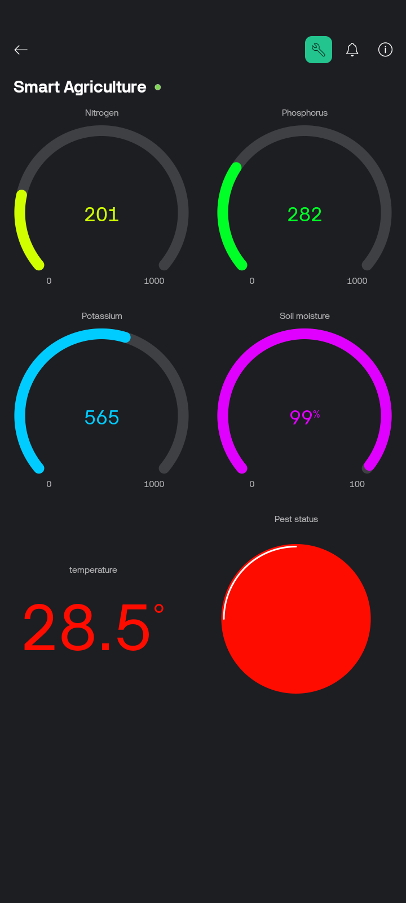

# 🌾 Smart Agriculture Monitoring System

A Raspberry Pi-based IoT system that monitors environmental and soil parameters to support data-driven farming decisions.

---

## 🧠 Overview

Farming success depends on precise, real-time understanding of soil and climate conditions.  
This system gathers data from multiple sensors and displays it remotely via **Blynk IoT**.

---

## 📊 Features

- 🌡️ Temperature and Humidity monitoring (DHT11)
- 💧 Soil Moisture sensing
- 🧪 NPK nutrient level detection
- 📲 Live dashboard for remote monitoring (Blynk)
- 🧾 Event logging for data analysis and alerts

---

## 🔧 Hardware Used

- Raspberry Pi 3B+
- DHT11 Sensor
- Soil Moisture Sensor
- NPK Sensor (Analog/Digital)
- Blynk IoT Dashboard
- ESP32 for edge relay, GSM backup module

---

## 🛠️ Architecture

[Multiple Sensors] → [Raspberry Pi] → [Data Processing] → [Blynk Dashboard + Logging]


> Sensor values are transmitted to the mobile app and updated in real-time.  
> Thresholds can trigger alerts or actuator logic in future versions.

---

## 📸 Screenshots / Dashboard



---

<pre> 📁 Folder Structure 
``` smart-agriculture-monitoring/ 
├── README.md
├── main.py
├── blynk-dashboard.png
├── wiring-diagram.png
├── requirements.txt ``` </pre>

---

## 🚀 Future Enhancements

- GSM + offline mode
- Add ML-based trend detection
- Actuator automation (e.g., irrigation based on thresholds)
- Solar + weatherproof enclosure

---

## 🤝 Connect With Me

Built by **Engr. Psalmol – Remote IoT & Embedded Systems Engineer**  
📫 akpsalmol@gmail.com  
🔗 [LinkedIn]: (https://www.linkedin.com/in/olalekan-samuel-akadiri-9b43a91b3/)
🌍 [GitHub]: (https://github.com/Psalmol/)
